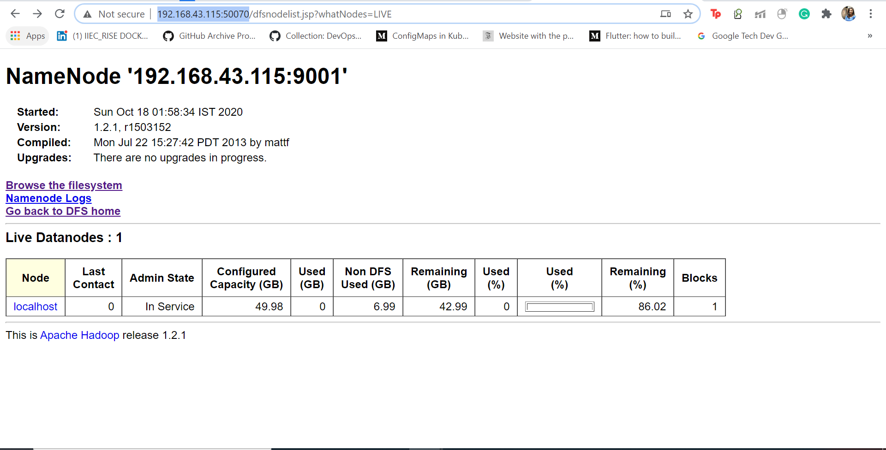
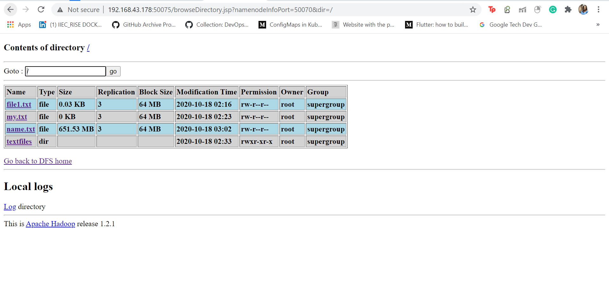

# Hadoop-CheatSheet 🐘

A cheatsheet to get you started with Hadoop
<p align="center">

</p>
  
## Installation (For 1 master and multi slave and multi client nodes)
**For Master,Slave and Client Nodes** 
```
This is for RedHat
    - Install Java JDK as Hadoop depends on it
        wget https://www.oracle.com/webapps/redirect/signon?nexturl=https://download.oracle.com/otn/java/jdk/8u171-b11/512cd62ec5174c3487ac17c61aaa89e8/jdk-8u171-linux-x64.rpm
        rpm -i -v -h jdk-8u171-linux-x64.rpm
    - Install apache hadoop
        wget https://archive.apache.org/dist/hadoop/core/hadoop-1.2.1/hadoop-1.2.1-1.x86_64.rpm
        rpm -i -v -h hadoop-1.2.1-1.x86_64.rpm --force
    - Verify if it is correctly installed with
        java -version
        hadoop version
```


## Configuration
### For Master Node also called NameNode
```
    mkdir /nn
    vim /etc/hadoop/core-site.xml
        <configuration>
            <property>
                <name>fs.default.name</name>
                <value>hdfs://MasterIP:PortNo</value>
            </property>
        </configuration>

    vim /etc/hadoop/hdfs-site.xml
        <configuration>
            <property>
                <name>dfs.name.dir</name>
                <value>/nn</value>
            </property>
        </configuration>

```

The configured files:

#Check if the port number you assigned is free, if not then change the port number in the core-site.xml

Then we will have to format the /nn folder of the namenode.
``` hadoop namenode -format ```
<br>

```
    jps 
    netstat -tnlp 
```
We see that the process has not yet started and the assigned port is free 


#### Then we will have to start the service:
```
hadoop-daemon.sh start namenode
jps
netstat -tnlp
```
We see that the process has started and the port is assigned


To view the no of slave nodes connected
```hadoop dfsadmin -report``` 


### For Slave Node also called DataNode

```
    vim /etc/hadoop/core-site.xml
        <configuration>
            <property>
                <name>fs.default.name</name>
                <value>hdfs://MasterIP:PortNo</value>
            </property>
        </configuration>
    mkdir /dn1
    vim /etc/hadoop/hdfs-site.xml
        <configuration>
            <property>
                <name>dfs.name.dir</name>
                <value>/dn1</value>
            </property>
        </configuration>
```
The Configured files:


#### Then we will have to start the service
Make sure that if you doing the setup locally using VM's , then the firewall should be stopped in the master node.
To check so:
```
    systemctl status firewalld
   - If it is active then stop or disable(if you don't want to start after system reboot)
        systemctl stop firewalld
        systemctl disable firewalld
```


```
hadoop-daemon.sh start datanode
jps
```
We see that the process has started.


To view the no of slave nodes connected

```hadoop dfsadmin -report```


### For Client Node 

```
    vim /etc/hadoop/core-site.xml
        <configuration>
            <property>
                <name>fs.default.name</name>
                <value>hdfs://MasterIP:PortNo</value>
            </property>
        </configuration>

    - To see how many files we have in their storage
        hadoop fs -ls /
    - To add a file
        cat > /file1.txt
        Hi I am the first file
        Ctrl+C
        hadoop fs - put /file1.txt /
    - To read the contents of the file
        hadoop fs -cat /file1.txt
    - To check the size of the file
        hadoop fs -count /file1.txt
    - To create a directory
        hadoop fs -mkdir /textfiles
    -To upload a blank file on the fly
        hadoop fs -touchz /my.txt
    -To move a file (source➡destination)
        hadoop fs -mv /lw.txt /textfiles
    - To copy a file (source➡destination)
        hadoop fs -cp /file1.txt /textfiles
    - To remove a file
        hadoop fs -rm  /file1.txt
    - To checkout and explore all the available options
        hadoop fs 
```
The attached screenshots of the above mentioned commands are :


### We can also visualize using GUI
    Namenode : MasterIP:50070
    Datanode : SlaveIP:50075

We can visualize the uploaded files


We see that if the file is small it is broken in only 1 block

We can check the size of the name.txt file like:
```
    -To see the permissions as well as the size of the block in bytes
        ls -l name.txt
    -To see the permissions as well as the size of the block 
        ls -l -h name.txt
```

The default DFS block size is 32768 , and therefore it is divided into blocks before storing. 


## Contributing

Contributions are what make the open source community such an amazing place to be learn, inspire, and create. Any contributions you make are **greatly appreciated**.

1. Fork the Project
2. Create your Feature Branch (`git checkout -b feature/AmazingFeature`)
3. Commit your Changes (`git commit -m 'Add some AmazingFeature'`)
4. Push to the Branch (`git push origin feature/AmazingFeature`)
5. Open a Pull Request


## Cool Links to Checkout 

- [How Facebook stores so much data and its statistics](https://shirshadatta2000.medium.com/how-facebook-stores-so-much-data-and-its-statistics-bd0911ad39a1)

- [Facebook and Hadoop](https://www.facebook.com/notes/facebook-engineering/hadoop/16121578919/)

- [How Google stores massive amounts of data](https://medium.com/@avantikadasgupta/how-google-stores-massive-amounts-of-data-bigtable-d67f49bfc40e)

- [Apache Hadoop Ecosystem](https://www.cloudera.com/products/open-source/apache-hadoop.html)

## License

Distributed under the MIT License. See `LICENSE` for more information.

## Contact

- My Name - Shirsha Datta
 
- You can contact me at shirshadatta2000@gmail.com

- Connect with me on [LinkedIn](https://www.linkedin.com/in/shirsha-datta-30335a178/)

<!--** 
Some intro to big data nd apache
How to change block size
** Make it more readable
** safemode and tcpdump
** Who is the one uploading the file?
✴️ Answer: Client gets the IP from Master and uploads the file to DataNode.

**Does client go to master and then read the file on slave via Master or Does Client go to slave directly and read the data?
✴️ Answer: Client goes to slave directly and reads the data stored on slave.
-->

<!-- ADD IF NECESSARY
# Contributing

When contributing to this repository, please first discuss the change you wish to make via issue,
email, or any other method with the owners of this repository before making a change. 


## Pull Request Process
1. Ensure any install or build dependencies are removed before the end of the layer when doing a 
   build.
2. Update the README.md with details of changes to the interface, this includes new environment 
   variables, exposed ports, useful file locations and container parameters.
3. Only send your pull requests to the development branch where once we reach a stable point 
    it will be merged with the   master branch 
4. Associate each Pull Request with the required issue number 

## Branch Policy 
* development: If you are making a contribution make sure to send your Pull Request to this branch . All
            developments goes in this branch.
* master: After significant features/bug-fixes are accumulated in development branch we merge it with the master branch.

## Contribution Practices
* Write clear and meaningful commit messages.
* If you report a bug please provide steps to reproduce the bug.
* In case of changing the backend routes please submit an updated routes documentation for the same.
* If there is an UI related change it would be great if you could attach a screenshot 
 with the resultant changes so it is easier to review for the maintainers 
-->
