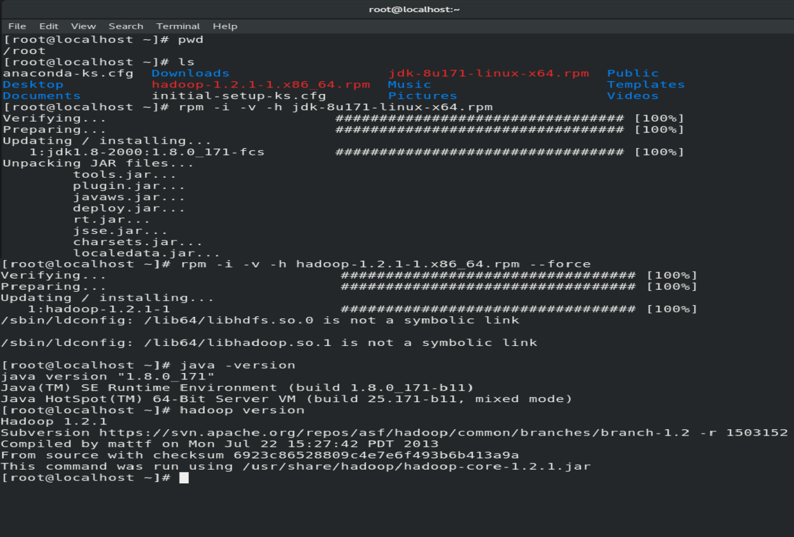

# Hadoop-CheatSheet 🐘

A cheatsheet to get you started with Hadoop
<p align="center">

</p>
  
## Installation 
**For Master and Slave Nodes** 
```
This is for RedHat
    - Install Java JDK as Hadoop depends on it
        wget https://www.oracle.com/webapps/redirect/signon?nexturl=https://download.oracle.com/otn/java/jdk/8u171-b11/512cd62ec5174c3487ac17c61aaa89e8/jdk-8u171-linux-x64.rpm
        rpm -i -v -h jdk-8u171-linux-x64.rpm
    - Install apache hadoop
        wget https://archive.apache.org/dist/hadoop/core/hadoop-1.2.1/hadoop-1.2.1-1.x86_64.rpm
        rpm -i -v -h hadoop-1.2.1-1.x86_64.rpm --force
    - Verify if it is correctly installed with
        java -version
        hadoop version
```


## Configuration
### For Master Node also called NameNode
```
    mkdir /nn
    vim /etc/hadoop/core-site.xml
        <configuration>
            <property>
                <name>fs.default.name</name>
                <value>hdfs://MasterIP:PortNo</value>
            </property>
        </configuration>

    vim /etc/hadoop/hdfs-site.xml
        <configuration>
            <property>
                <name>dfs.name.dir</name>
                <value>/nn</value>
            </property>
        </configuration>

```

The configured files:

#Check if the port number you assigned is free, if not then change the port number in the core-site.xml

Then we will have to format the /nn folder of the namenode.
``` hadoop namenode -format ```
<br>

```
    jps 
    netstat -tnlp 
```
We see that the process has not yet started and the assigned port is free 


#### Then we will have to start the service:
```
hadoop-daemon.sh start namenode
jps
netstat -tnlp
```
We see that the process has started and the port is assigned


To view the no of slave nodes connected
```hadoop dfsadmin -report``` 


### For Slave Node also called DataNode

```
    vim /etc/hadoop/core-site.xml
        <configuration>
            <property>
                <name>fs.default.name</name>
                <value>hdfs://MasterIP:PortNo</value>
            </property>
        </configuration>
    mkdir /dn1
    vim /etc/hadoop/hdfs-site.xml
        <configuration>
            <property>
                <name>dfs.name.dir</name>
                <value>/dn1</value>
            </property>
        </configuration>
```
The Configured files:


#### Then we will have to start the service
Make sure that if you doing the setup locally using VM's , then the firewall should be stopped in the master node.
To check so:
```
    systemctl status firewalld
   - If it is active then stop or disable(if you don't want to start after system reboot)
        systemctl stop firewalld
        systemctl disable firewalld
```


hadoop-daemon.sh start datanode
jps
```
We see that the process has started.


To view the no of slave nodes connected

```hadoop dfsadmin -report``` 


### For Client Node 

```
    vim /etc/hadoop/core-site.xml
        <configuration>
            <property>
                <name>fs.default.name</name>
                <value>hdfs://MasterIP:PortNo</value>
            </property>
        </configuration>

    - To see how many files we have in their storage
        hadoop fs -ls /
    - To add a file
        cat > file1.txt
        Hi I am the first file
        Ctrl+C
        hadoop fs - put file1.txt
    - To read the contents of the file
        hadoop fs -cat /file1.txt
    - To remove a file
        hadoop fs -rm  /file1.txt
```
